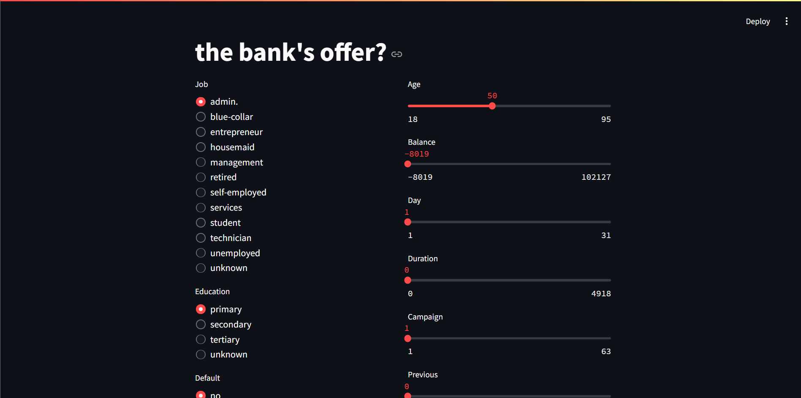

# Tajemnicza Ekipa - SUM

## Introduction
The goal of this project is to create an application utilizing a Machine Learning engine to predict whether a bank client will subscribe to a term deposit based on marketing campaign data. The application was developed by the project group "Tajemnicza Ekipa".

## Context

Term deposits are an important source of income for a bank. A term deposit is a cash investment held at a financial institution, where the money is invested at an agreed interest rate for a fixed period. The bank has various marketing plans to sell term deposits to its clients, such as email marketing, advertisements, telephonic marketing, and digital marketing.

Telephonic marketing campaigns remain one of the most effective ways to reach people. However, they require significant investment as large call centers are hired to execute these campaigns. Therefore, it is crucial to identify customers most likely to convert so that they can be specifically targeted via calls.

The data relates to direct marketing campaigns (phone calls) of a Portuguese banking institution. The classification goal is to predict if the client will subscribe to a term deposit (variable y).

## Content

The data is related to the direct marketing campaigns of a Portuguese banking institution, conducted via phone calls. Often, more than one contact to the same client was required to assess if the product (bank term deposit) would be subscribed to by the client ('yes') or not ('no'). The data folder contains two datasets:

* train.csv: 45,211 rows and 18 columns ordered chronologically (from May 2008 to November 2010)
* test.csv: 4521 rows and 18 columns containing 10% of the examples (4521), randomly selected from train.csv

## Detailed Column Descriptions

### Bank Client Data:
* age - numeric
* job - type of job (categorical: "admin.","unknown","unemployed","management","housemaid","entrepreneur","student","blue-collar","self-employed","retired","technician","services")
* marital - marital status (categorical: "married","divorced","single"; note: "divorced" means divorced or widowed)
* education - (categorical: "unknown","secondary","primary","tertiary")
* default - has credit in default? (binary: "yes","no")
* balance - average yearly balance, in euros (numeric)
* housing - has housing loan? (binary: "yes","no")
* loan - has personal loan? (binary: "yes","no")

### Data Related to the Last Contact of the Current Campaign:
* contact - contact communication type (categorical: "unknown","telephone","cellular")
* day - last contact day of the month (numeric)
* month - last contact month of the year (categorical: "jan", "feb", "mar", …, "nov", "dec")
* duration - last contact duration, in seconds (numeric)

### Other Attributes:
* campaign - number of contacts performed during this campaign and for this client (numeric, includes last contact)
* pdays - number of days that passed by after the client was last contacted from a previous campaign (numeric, -1 means client was not previously contacted)
* previous - number of contacts performed before this campaign and for this client (numeric)
* poutcome - outcome of the previous marketing campaign (categorical: "unknown","other","failure","success")

### Output Variable (Desired Target):
* y - has the client subscribed to a term deposit? (binary: "yes","no")

### Missing Attribute Values:
None

## Requirements

To run the project, the following dependencies are needed:

* scikit-learn==1.5.0
* pandas==2.2.2
* streamlit==1.35.0
* ipykernel==6.29.4
* seaborn==0.13.2

## Setup Environment

1. `git clone git@github.com:Teams21/SUM.git`
2. `cd SUM`
3. `python -m venv .`
4. `python -m pip install -U pip`
5. `pip install -r requirements.txt`

## Running the Application

To run the application, follow these steps:

1. Make sure Docker is installed.
2. Build the Docker image by running the command below, assuming you're in the SUM directory:

```sh
docker build -t s22678suml/projekt:1.0-slim .
```
3. Run the Docker container using the command below or by running run.sh or run.ps1:
```sh
docker run -dp 0.0.0.0:8501:8501 s22678suml/projekt:1.0-slim
```


## Setup Development 

git checkout -b branch_name
Do work...
First push:
git push -u origin branch_name
All other push commands:
git push
Merge when done (use pull requests)